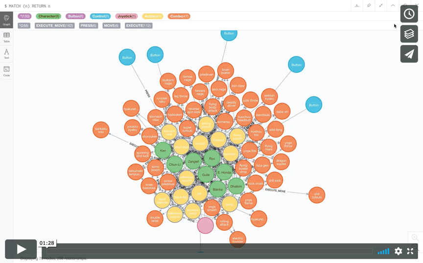

# "Broken" Street Fighter

Brief
------

"Broken" Street Fighter is an impact analysis site that allows users to determine which actions they can no longer use if one of their video game controls is broken.

As part of the coding bootcamp I'm attending, we were tasked with developing a "useless" application in two days. The only requirements we had to fulfill were that the application had to use a database, and it had to have a front-end interface. Although we did not cover graph databases in the coding bootcamp, I was familiar with the concept, and thought this would be a great opportunity to learn more. I knew one of the major use cases for graph databases was network and IT operations, and thought an arcade game would be the perfect way to represent this model. In two days, my partner and I learned how to use Neo4j graph database, Cypher querying language, and Neo4j's JavaScript driver, created a database, and developed a fully-functioning, Node.js-based, full-stack, "useless" application.

View Demo:

Concept 
------ 

In Street fighter, a combo (somersault kick) is dependent on an action (jump), which is dependent on a control (joystick), but only when the control is moved in a specific direction (up). The combo (somersault kick) is also dependent on the selection of a character (Ryu) (The combo is also dependent on a host of factors we left out, eg. the start button, the screen working, electricity, etc., but let's ignore those for now!).

In a relational database model, you might store this data in multiple tables: Combo, Action, Control, Control Direction, Character. You would need to perform a number of joins to get the impact analysis results you want, and if you ever wanted to do more than analyze the impact of a broken control, you would likely need to change your database schema or develop an even more complicated query. Graphing databases are designed to store interconnected data such as this, and make traversing dependencies across a network easy. With Neo4j and Cypher, all we need is a simple query to perform the analysis we want: "MATCH (c:Joystick)-[rel:MOVE]->(a:Action), (p:Character)-->(a) WHERE p.name='Ryu' AND rel.direction='up' OPTIONAL MATCH (a)-->(d:Combo) RETURN a, d".

While "Broken" Street Fighter's utilization of Ne04j was fairly limited, the capacity of the database to support related activities and analysis is far reaching, even in its current state. Our application focussed on analyzing the impact of a single control breaking. However, we could just as easily use the database to analyze the impact of multiple controls breaking, of the entire joystick breaking, or even upstream issues like the start button not working. We could even use our database to determine which characters would be most affected by certain controls breaking. Similar to network and IT operations, we could also use our database to figure out the source of issues, as opposed to the impact of issues. Say we knew which actions weren't working while playing Street Fighter. We could use our current database to determine which controls are broken. Furthermore, graph databases easily allow for changing requirements, including a growing number of nodes, relationships, and properties. Say we wanted to update our application to support Street Fighter Three. We could simply create nodes for new characters, nodes for new actions, and connect them with relationships. We could just as easily add a new button, or even change what an existing button does.

Technologies 
------ 

"Broken" Street Fighter's core functionality, its ability to assess the impact of a broken controller for any character, is made possible by querying a Neo4j database using Cypher query language. The database, including all nodes, relationships, and properties, were created by me and my partner. The database was accessed via Node using Cypher and Neo4j's JavaScript driver.

* HTML
* CSS
* Mustache
* JavaScript
* Node.js
* Express.js
* Neo4j
* Cypher

Launch
------

"Broken" Street Fighter can be accessed at the following url: [https://broken-street-fighter-2.herokuapp.com](https://broken-street-fighter-2.herokuapp.com)

Team
------

* [Kelsey Gaetjens](https://github.com/kjgaetjens/)
* [Elizabeth Vasquez](https://github.com/elizabethsv)